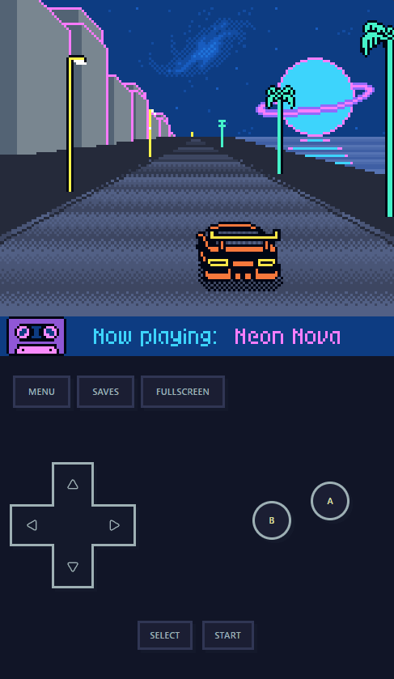

# GBEmu

A TypeScript-based Game Boy / Game Boy Color emulator that runs in the browser. Try it out at https://gb.thecodeboss.com.



The game shown above is [Neon Nova](https://playinstinct.itch.io/neon-nova) by [playinstinct](https://playinstinct.itch.io/).

## Features

- Plays Game Boy and Game Boy Color ROMs in the browser - if you find any that don't work, please open an issue!
- Supports most game controllers: DualShock/DualSense, Xbox, Switch Pro, and more via the Gamepad API. Can also be played with keyboard controls or touch input on mobile devices.
- Battery-backed saves, which persist automatically in IndexedDB and can be imported/exported as `.sav` files.
- Save files can optionally be synced across devices if you sign in with Google or Discord (note: we DO NOT store your ROMs and cannot sync them, only the save files).
- PWA installable on mobile and desktop browsers.

## Limitations

- The emulator does not support Super Game Boy (SGB) features at this time.

## Technical Overview

The project is structured as a pnpm workspace. The repository houses the core emulator implementation, a browser-oriented runtime, and a React SPA that boots the emulator in the browser. The web UI launches the emulator inside a dedicated Web Worker via Comlink, so the main thread stays focused on rendering and input while the worker handles emulation, audio, and save events.

Key frameworks and libraries used:

- [Vite](https://vitejs.dev/) for fast development and optimized builds.
- [Preact](https://preactjs.com/) for the web UI.
- [Tailwind CSS](https://tailwindcss.com/) for styling.
- [Comlink](https://github.com/GoogleChromeLabs/comlink) for simplified worker communication.
- [Shadcn](https://ui.shadcn.com/) for UI components.
- [Rolldown](https://rolldown.rs/) for JS bundling.
- [LightningCSS](https://lightningcss.dev/) for CSS minification.
- [Vitest](https://vitest.dev/) for testing.
- [Supabase](https://supabase.com/docs) for authentication and save file storage.

Tests rely on some community test ROMs:

- [Mooneye Test Suite](https://github.com/Gekkio/mooneye-test-suite/)
- [Blargg's Game Boy Test ROMs](https://github.com/retrio/gb-test-roms)

## Prerequisites

- Node.js 20+
- `pnpm` 10 (see `packageManager` in `package.json`)

## Install

```bash
pnpm install
```

## Run

- Start the web UI (opens Vite dev server):
  ```bash
  pnpm dev
  ```
- Lint:
  ```bash
  pnpm lint
  ```
- Build:
  ```bash
  pnpm build
  ```

## Testing

Not all tests are passing at the time of writing. To test, first prepare the test ROMs by running:

```bash
pnpm prepare-test-roms
```

Then run the tests with:

```bash
pnpm test
```

## Supabase Setup

Supabase is used for authentication and save file storage. To set up your own Supabase backend, follow these steps:

1. Create a free Supabase account at https://supabase.com/.
2. Create a new project.
3. Enable authentication providers (Google and/or Discord).
4. Create a new table named `saves` with the following SQL schema:

```sql
create table public.saves (
  id uuid not null default gen_random_uuid(),
  "createdAt" timestamp with time zone not null default now(),
  "updatedAt" timestamp without time zone not null default now(),
  "userId" uuid not null default auth.uid(),
  "gameId" character varying not null,
  name character varying not null,
  payload bytea not null,
  constraint saves_pkey primary key (id),
  constraint saves_userId_fkey foreign KEY ("userId") references auth.users (id) on update CASCADE on delete CASCADE
) TABLESPACE pg_default;
```

5. Set up Row Level Security (RLS) policies for the `saves` table:

```sql
create policy "Enable insert/update/delete for users based on user_id"
on "public"."saves"
as PERMISSIVE
for ALL
to authenticated
using (
  (( SELECT auth.uid() AS uid) = "userId")
) with check (
  (( SELECT auth.uid() AS uid) = "userId")
);

create policy "Enable users to view their own data only"
on "public"."saves"
as PERMISSIVE
for SELECT
to authenticated
using (
  (( SELECT auth.uid() AS uid) = "userId")
);
```

6. Create a `.env.local` file in `apps/web/` with the following contents:

```
VITE_SUPABASE_URL=https://<project_id>.supabase.co
VITE_PUBLIC_SUPABASE_ANON_KEY=<anon_key>
```

## Legal & Usage

GBEmu is an independent, fan-made emulator. It is not affiliated with, endorsed by, or sponsored by Nintendo or any other company.

This project does **not** include any copyrighted game or BIOS data. To use GBEmu you must provide your own legally obtained ROMs. Do not use this project to play games you do not own or to distribute copyrighted content.

GBEmu is provided **“as is”**, without any warranty of any kind, express or implied. The author(s) are not liable for any claims, damages, or other liability arising from the use of this software.

Nothing in this repository constitutes legal advice. Please ensure your own use complies with applicable laws in your jurisdiction.

## License

This project is licensed under the [MIT License](./LICENSE).
If you use GBEmu in your own projects, please keep the copyright notice with the repository URL.
